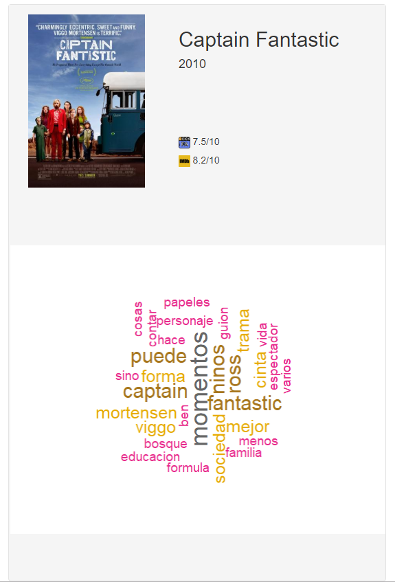

## Imagen identificativa

## Enlace a la plataforma

https://carlosmartin.shinyapps.io/QueVeoEstaNoche/ 

## Descripción

El conjunto de datos extraído se trata de información sobre películas y series de televisión. Se trata de información extraída de filmaffinity y de IMDB utilizando un sistema de scraping basado en R, con las librerías httr y rvest. 

IMDB y FilmAffinity son dos webs relativamente parecidas que dan información sobre películas en profundidad: sus actores, productores, premios, e incluye además una parte interesante para el usuario promedio: una puntuación de la película y comentarios con las opiniones de gente de a pie.

Es necesario sin embargo que ponga en contexto el trabajo realizado. En vez de hacer un trabajo de incluir un listado de películas y _scrapear_ para sacar la información, estuve pensando que sería mucho más interesante si reorientara el scraping hacia un modelo colaborativo por motivos éticos. 

Es muy posible que si incluyera un listado de miles de películas, sólo un pequeño porcentaje de ellas fuera a ser realmente visitado. A la vez, habría por otro lado una gran cantidad de películas que no estarían incluidas y que en el _long-tail_ muchos potenciales usuarios las encontrarían a faltar.

Para evitar sobresaturar las webs de filmaffinity y de imdb, ya que han sido tan amables de no limitar demasiado el scraping desde su fichero robots.txt, he montado una plataforma basada en R Shiny. De manera que:

1. Usuario busca un título
2. Se almacena la cadena de búsqueda en una tabla ("Historial de Búsquedas") y se busca en ambas webs. Tras ello, almacenamos el título original con el resto de información que se ha considerado relevante para este ejercicio. Los resultados de la película son guardados en "Historial de Películas", además de actualizar la tabla de "Historial de Búsquedas" para incluir la nueva información
3. Si la cadena de búsqueda ya hubiese aparecido con anterioridad, y la información la consideramos suficientemente reciente (menos de 6 meses naturales), mostramos la información que tenemos almacenada. Si no, se inicia efectivamente el proceso de scraping.
4. Por supuesto, detecto algunas posibles mejoras que hacer, tanto en la plataforma como en el motor. Podríamos extraer más información, y se podrían implementar mejoras en el diseño.

Mi intención con esto además era tratar de seguir con el proceso de datos de una manera dinámica.

## Contexto

Mi idea surgió de algo simple: ¿Qué puedo ver esta noche? Las webs de cine están llenas de información y cuesta obtener información simple y directa para decir "esta película vale la pena ver". Por ello los outputs son sencillos:

* Puntuación en dos plataformas diferentes: IMDB tiene una gran cobertura, pero en FilmAffinity suelen ser más de fiar
* Nube de palabras de los comentarios: Cuando quieres mirar rápidamente qué dice la gente de cinco películas diferentes, puedes leer en diagonal... o puedes hacer una nube de palabras que te filtre ya de antemano la información.

\newpage
## Contenido

De la extracción de películas tenemos:

* **Title**: Título de la película
* **Rating_FA**: Puntuación en FilmAffinity
* **Year**: Año de la película
* **Poster**: URL con el poster de la película
* **Url**: URL donde se encuentra la reseña de FilmAffinity
* **Rating_IMDB**: Puntuación en la Internet Movie DataBase
* **URL_IMDB**: URL donde se encuentra la reseña de IMDB
* **Acty_Date**: Fecha de actualización de la película.

De los comentarios:
* **Rating**: Puntuación en FilmAffinity
* **Detalle**: Contenido de la reseña en FilmAffinity
* **inclusionDate**:  Fecha de actualización de la película.
* **Title**: Título de la película
* **URL**: URL con el poster de la película

## Agradecimientos

Los datos han sido recolectados desde la base de datos online [IMDB](http://www.imdb.com) y [FilmAffinity](https://www.filmaffinity.com/es/main.html) . Para ello, se ha hecho uso del lenguaje de programación R y de técnicas de *Web Scraping* para extraer la información alojada en las páginas HTML.

## Inspiración

En este caso la inspiración surge de un proyecto personal que hace tiempo que quería implementar. Conectar diversas fuentes tanto de opiniones sobre contenido como fuentes de proveedores (algo que tras estudiarlo, vi que se salía del scope para esta práctica) para ver tanto qué hay como dónde se puede ver. Con esta informacion, ID's de usuario y actividades, sería además sencillo empezar a incluir recomendaciones de películas personalizadas según lo que vemos en el cine, en netflix o en la televisión.

Veo esta plataforma como un primer paso en esa dirección

## Licencia

La licencia escogida para la publicación de este conjunto de datos y la plataforma ha sido **Mozilla Public License 2.0**. Los motivos que han llevado a la elección de esta licencia tienen que ver con la idoneidad de las cláusulas que esta presenta en relación con el trabajo realizado:

* *Se debe proveer el nombre del creador del conjunto de datos generado, indicando los cambios que se han realizado*. Aunque no he reinventado la rueda, el código generado es suficientemente útil y flexible y esperaría que me mencionaran si se reutiliza.

* *Se permite un uso comercial*. Como ferviente creyente del código libre, veo perfecto que mi trabajo sea reutilizado incluso bajo uso comercial. 

* *No se permite el reuso de la marca "Que veo esta noche*. Al considerar esto como parte de un proyecto más grande, la _marca_ considero importante que se mantenga siempre dentro de este proyecto.

## Código fuente y dataset

Tanto el código fuente escrito para la extracción de datos como el dataset generado pueden ser accedidos a través de [este enlace](https://github.com/carlosmartinmari/MovieRating_Scraper).

